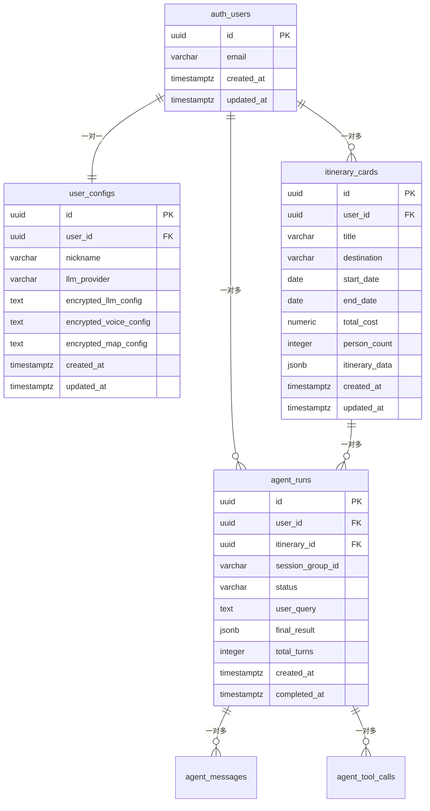

# AI旅行规划师 - 数据结构规格说明

## 📋 文档信息
- **文档版本**: v1.0
- **创建日期**: 2025年11月7日
- **最后更新**: 2025年11月7日
- **文档状态**: 待完善
- **数据库版本**: PostgreSQL 15 (Supabase)

---

## 1. 数据库概览

### 1.1 数据库架构

**数据库引擎**: PostgreSQL 15.0 (Supabase托管)
**数据库特性**: 
- 🔐 内置认证系统 (auth schema)
- 🛡️ 行级安全 (RLS) 
- ⚡ 实时订阅 (Realtime)
- 📊 自动备份和恢复

**Schema组织**:
```sql
-- 系统Schema
auth.*           -- Supabase认证表 (系统管理)
storage.*        -- 文件存储表 (系统管理)
realtime.*       -- 实时订阅表 (系统管理)

-- 应用Schema  
public.*         -- 应用业务表 (用户数据)
```

### 1.2 表关系图



### 1.3 命名规范

#### 1.3.1 表命名规范
- **格式**: `snake_case` 小写下划线
- **复数形式**: 表名使用复数 (`users`, `configs`, `cards`)
- **前缀规则**: 
  - 业务表无前缀 (`itinerary_cards`)
  - 系统表有前缀 (`auth_users`)

#### 1.3.2 字段命名规范
- **主键**: 统一使用 `id` (uuid类型)
- **外键**: `{table}_id` 格式 (`user_id`, `itinerary_id`)
- **时间字段**: 
  - `created_at`: 创建时间
  - `updated_at`: 更新时间
  - `{action}_at`: 特定动作时间 (`completed_at`, `deleted_at`)
- **布尔字段**: `is_` 或 `has_` 前缀 (`is_public`, `has_config`)

#### 1.3.3 索引命名规范
```sql
-- 索引命名: idx_{table}_{column(s)}
CREATE INDEX idx_itinerary_cards_user_id ON itinerary_cards(user_id);
CREATE INDEX idx_agent_runs_session_group ON agent_runs(session_group_id);
CREATE INDEX idx_agent_messages_run_id ON agent_messages(agent_run_id);
```

---

## 2. 核心数据表

### 2.1 用户认证表 (auth.users)

**表说明**: Supabase内置认证表，存储用户基础认证信息
**管理方式**: 系统自动管理，不可直接修改
**数据生命周期**: 永久保存 (除非用户删除账户)

```sql
-- 系统表结构 (只读)
TABLE auth.users (
  id uuid PRIMARY KEY DEFAULT gen_random_uuid(),
  aud varchar(255),                    -- 受众标识
  role varchar(255),                   -- 用户角色 
  email varchar(255) UNIQUE,           -- 邮箱地址
  encrypted_password varchar(255),     -- 加密密码
  email_confirmed_at timestamptz,      -- 邮箱确认时间
  invited_at timestamptz,              -- 邀请时间
  confirmation_token varchar(255),     -- 确认令牌
  confirmation_sent_at timestamptz,    -- 确认发送时间
  recovery_token varchar(255),         -- 恢复令牌
  recovery_sent_at timestamptz,        -- 恢复发送时间
  email_change_token_new varchar(255), -- 邮箱变更令牌
  email_change varchar(255),           -- 新邮箱
  email_change_sent_at timestamptz,    -- 邮箱变更发送时间
  last_sign_in_at timestamptz,         -- 最后登录时间
  raw_app_meta_data jsonb,             -- 应用元数据
  raw_user_meta_data jsonb,            -- 用户元数据
  is_super_admin boolean,              -- 是否超级管理员
  created_at timestamptz,              -- 创建时间
  updated_at timestamptz,              -- 更新时间
  phone varchar(255),                  -- 电话号码
  phone_confirmed_at timestamptz,      -- 电话确认时间
  phone_change varchar(255),           -- 新电话
  phone_change_token varchar(255),     -- 电话变更令牌
  phone_change_sent_at timestamptz,    -- 电话变更发送时间
  confirmed_at timestamptz,            -- 确认时间
  email_change_token_current varchar(255), -- 当前邮箱变更令牌
  email_change_confirm_status smallint, -- 邮箱变更确认状态
  banned_until timestamptz,            -- 封禁到期时间
  reauthentication_token varchar(255), -- 重新认证令牌
  reauthentication_sent_at timestamptz, -- 重新认证发送时间
  is_sso_user boolean DEFAULT false,   -- 是否SSO用户
  deleted_at timestamptz               -- 删除时间
);
```

**关键字段说明**:
| 字段 | 类型 | 说明 | 业务用途 |
|------|------|------|----------|
| `id` | uuid | 用户唯一标识 | 外键关联，全局用户ID |
| `email` | varchar(255) | 邮箱地址 | 登录凭据，用户标识 |
| `email_confirmed_at` | timestamptz | 邮箱确认时间 | 判断邮箱是否已验证 |
| `last_sign_in_at` | timestamptz | 最后登录 | 活跃度统计 |
| `raw_user_meta_data` | jsonb | 用户元数据 | 存储昵称等自定义信息 |

### 2.2 用户配置表 (user_configs)

**表说明**: 存储用户的API配置和个人设置
**文件位置**: `supabase/migrations/20241030083307_create_user_configs_table.sql`
**安全策略**: RLS启用，用户只能访问自己的配置

```sql
CREATE TABLE user_configs (
  id uuid DEFAULT gen_random_uuid() PRIMARY KEY,
  user_id uuid REFERENCES auth.users(id) ON DELETE CASCADE,
  
  -- 用户基础信息
  nickname varchar(50),                 -- 用户昵称
  
  -- LLM配置 (加密存储)
  llm_provider varchar(20),             -- LLM提供商 
  llm_model varchar(50),                -- LLM模型名称
  encrypted_llm_config text,            -- 加密的LLM配置JSON
  
  -- 语音配置 (加密存储)  
  encrypted_voice_config text,          -- 加密的语音配置JSON
  
  -- 地图配置 (加密存储)
  encrypted_map_config text,            -- 加密的地图配置JSON
  
  -- 系统字段
  last_login_at timestamptz,            -- 最后登录时间
  created_at timestamptz DEFAULT now(),
  updated_at timestamptz DEFAULT now(),
  
  -- 约束
  UNIQUE(user_id)
);

-- 索引
CREATE INDEX idx_user_configs_user_id ON user_configs(user_id);
CREATE INDEX idx_user_configs_provider ON user_configs(llm_provider);

-- RLS安全策略
ALTER TABLE user_configs ENABLE ROW LEVEL SECURITY;

CREATE POLICY "Users can only access their own configs" ON user_configs
  FOR ALL USING (auth.uid() = user_id);
```

**字段详细说明**:
| 字段 | 类型 | 约束 | 说明 |
|------|------|------|------|
| `user_id` | uuid | FK, UNIQUE | 关联auth.users表，一对一关系 |
| `nickname` | varchar(50) | 可选 | 用户显示昵称，默认为邮箱前缀 |
| `llm_provider` | varchar(20) | 可选 | LLM服务商：openai/zhipu/moonshot/qwen |
| `llm_model` | varchar(50) | 可选 | 具体模型：gpt-4/glm-4/moonshot-v1-8k |
| `encrypted_llm_config` | text | 可选 | AES加密的LLM配置JSON |
| `encrypted_voice_config` | text | 可选 | AES加密的语音配置JSON |
| `encrypted_map_config` | text | 可选 | AES加密的地图配置JSON |

**加密配置JSON结构**:
```typescript
// LLM配置 (加密前)
interface LLMConfig {
  apiKey: string;           // API密钥
  baseUrl?: string;         // 自定义API地址
  maxTokens: number;        // 最大Token数
  temperature: number;      // 生成温度
}

// 语音配置 (加密前)  
interface VoiceConfig {
  provider: 'xfyun' | 'baidu';
  appId: string;           // 应用ID
  apiKey: string;          // API密钥  
  apiSecret: string;       // API密钥
  language: 'zh-cn' | 'en-us';
}

// 地图配置 (加密前)
interface MapConfig {
  provider: 'amap';        // 目前只支持高德
  apiKey: string;          // 高德API Key
  securityCode?: string;   // 安全密钥(可选)
}
```

### 2.3 行程卡片表 (itinerary_cards)

**表说明**: 存储用户的行程卡片和详细行程数据
**文件位置**: `supabase/migrations/20241030074826_create_itinerary_cards_table.sql`
**数据特点**: 核心业务数据，支持复杂查询和排序

```sql
CREATE TABLE itinerary_cards (
  id uuid DEFAULT gen_random_uuid() PRIMARY KEY,
  user_id uuid REFERENCES auth.users(id) ON DELETE CASCADE,
  
  -- 基础信息
  title varchar(200) NOT NULL,          -- 行程标题
  description text,                     -- 行程描述  
  destination varchar(100),             -- 目的地
  
  -- 时间信息
  start_date date,                      -- 开始日期
  end_date date,                        -- 结束日期
  
  -- 预算信息
  total_cost numeric(10,2),             -- 总费用
  person_count integer DEFAULT 1,       -- 人数
  
  -- 核心数据
  itinerary_data jsonb,                 -- 详细行程JSON
  
  -- 展示信息
  thumbnail_url text,                   -- 缩略图URL
  tags text[],                          -- 标签数组
  
  -- 状态标志
  is_template boolean DEFAULT false,    -- 是否为模板
  is_public boolean DEFAULT false,      -- 是否公开
  
  -- 统计信息
  view_count integer DEFAULT 0,         -- 查看次数
  like_count integer DEFAULT 0,         -- 点赞次数
  
  -- 系统字段
  created_at timestamptz DEFAULT now(),
  updated_at timestamptz DEFAULT now()
);

-- 性能优化索引
CREATE INDEX idx_itinerary_cards_user_id ON itinerary_cards(user_id);
CREATE INDEX idx_itinerary_cards_destination ON itinerary_cards(destination);
CREATE INDEX idx_itinerary_cards_dates ON itinerary_cards(start_date, end_date);
CREATE INDEX idx_itinerary_cards_created ON itinerary_cards(created_at DESC);

-- GIN索引支持JSONB查询
CREATE INDEX idx_itinerary_cards_data_gin ON itinerary_cards USING gin(itinerary_data);

-- 数组标签索引
CREATE INDEX idx_itinerary_cards_tags ON itinerary_cards USING gin(tags);

-- RLS安全策略
ALTER TABLE itinerary_cards ENABLE ROW LEVEL SECURITY;

CREATE POLICY "Users can access their own itineraries" ON itinerary_cards
  FOR ALL USING (auth.uid() = user_id);

CREATE POLICY "Users can view public itineraries" ON itinerary_cards
  FOR SELECT USING (is_public = true);
```

**itinerary_data JSONB结构**:
```typescript
// 完整行程数据结构 (存储在itinerary_data字段)
interface ItineraryData {
  version: string;                      // 数据版本 "1.0"
  basic_info: {
    title: string;
    destination: string;
    duration: string;                   // "3天2晚"
    dates: {
      start: string;                    // "2024-12-01"  
      end: string;                      // "2024-12-03"
    };
    budget: {
      total: number;
      per_person: number;
      currency: string;                 // "CNY"
    };
    participants: number;
  };
  
  itinerary: DayPlan[];                // 每日行程
  cost_breakdown: CostBreakdown;       // 费用分解
  summary: {
    highlights: string[];              // 行程亮点
    tips: string[];                    // 旅行贴士
    total_distance: number;            // 总距离(km)
    estimated_time: number;            // 预计时间(hour)
  };
}
```

### 2.4 Agent运行记录表 (agent_runs)

**表说明**: 记录ReAct Agent的运行实例和结果
**文件位置**: `supabase/migrations/20241105081621_create_agent_tables.sql`
**业务价值**: Agent执行追踪，性能分析，错误调试

```sql
CREATE TABLE agent_runs (
  id uuid DEFAULT gen_random_uuid() PRIMARY KEY,
  user_id uuid REFERENCES auth.users(id) ON DELETE CASCADE,
  itinerary_id uuid REFERENCES itinerary_cards(id) ON DELETE SET NULL,
  
  -- 会话标识
  session_group_id varchar(36),         -- 会话组ID (UUID格式)
  
  -- 执行状态
  status varchar(20) DEFAULT 'running', -- running, completed, failed, timeout
  
  -- 输入输出
  user_query text NOT NULL,             -- 用户查询
  final_result jsonb,                   -- 最终结果JSON
  
  -- 统计信息
  total_turns integer DEFAULT 0,        -- 总轮次
  total_tokens_used integer DEFAULT 0,  -- 消耗Token数
  execution_time_ms integer,            -- 执行时间(毫秒)
  
  -- 错误信息
  error_message text,                   -- 错误信息
  error_details jsonb,                  -- 错误详情
  
  -- 时间字段
  created_at timestamptz DEFAULT now(),
  completed_at timestamptz,
  updated_at timestamptz DEFAULT now()
);

-- 索引
CREATE INDEX idx_agent_runs_user_id ON agent_runs(user_id);
CREATE INDEX idx_agent_runs_session_group ON agent_runs(session_group_id);
CREATE INDEX idx_agent_runs_status ON agent_runs(status);
CREATE INDEX idx_agent_runs_created ON agent_runs(created_at DESC);

-- RLS策略
ALTER TABLE agent_runs ENABLE ROW LEVEL SECURITY;

CREATE POLICY "Users can access their own agent runs" ON agent_runs
  FOR ALL USING (auth.uid() = user_id);
```

### 2.5 Agent消息表 (agent_messages)

**表说明**: 存储Agent运行过程中的所有消息记录
**数据特点**: 大数据量，时序性强，支持流式查询

```sql
CREATE TABLE agent_messages (
  id uuid DEFAULT gen_random_uuid() PRIMARY KEY,
  agent_run_id uuid REFERENCES agent_runs(id) ON DELETE CASCADE,
  
  -- 消息基础信息
  role varchar(20) NOT NULL,            -- user, assistant, system, tool
  content text,                        -- 消息内容
  message_type varchar(20),             -- text, thinking, action, observation
  
  -- Agent思维过程
  thought text,                        -- 思考内容
  action_name varchar(50),             -- 动作名称
  action_parameters jsonb,             -- 动作参数
  observation text,                    -- 观察结果
  
  -- 顺序和状态
  turn_number integer,                 -- 轮次编号
  step_number integer,                 -- 步骤编号
  is_final_answer boolean DEFAULT false, -- 是否最终答案
  
  -- 时间戳
  created_at timestamptz DEFAULT now()
);

-- 索引
CREATE INDEX idx_agent_messages_run_id ON agent_messages(agent_run_id);
CREATE INDEX idx_agent_messages_turn_step ON agent_messages(turn_number, step_number);
CREATE INDEX idx_agent_messages_created ON agent_messages(created_at);

-- RLS策略 (通过agent_runs关联用户)
ALTER TABLE agent_messages ENABLE ROW LEVEL SECURITY;

CREATE POLICY "Users can access their agent messages" ON agent_messages
  FOR ALL USING (
    EXISTS (
      SELECT 1 FROM agent_runs 
      WHERE agent_runs.id = agent_messages.agent_run_id 
      AND agent_runs.user_id = auth.uid()
    )
  );
```

### 2.6 Agent工具调用表 (agent_tool_calls)

**表说明**: 记录Agent工具调用的详细信息
**用途**: 工具使用统计，性能监控，错误分析

```sql
CREATE TABLE agent_tool_calls (
  id uuid DEFAULT gen_random_uuid() PRIMARY KEY,
  agent_run_id uuid REFERENCES agent_runs(id) ON DELETE CASCADE,
  message_id uuid REFERENCES agent_messages(id) ON DELETE CASCADE,
  
  -- 工具信息
  tool_name varchar(50) NOT NULL,      -- calculate_distance, search_nearby, estimate_cost
  
  -- 调用参数和结果
  input_parameters jsonb NOT NULL,     -- 输入参数
  output_result text,                  -- 输出结果
  
  -- 执行状态
  status varchar(20) DEFAULT 'pending', -- pending, success, failed
  error_message text,                  -- 错误消息
  
  -- 性能指标  
  execution_time_ms integer,           -- 执行时间
  tokens_used integer DEFAULT 0,       -- 消耗Token (如适用)
  
  -- 时间戳
  started_at timestamptz DEFAULT now(),
  completed_at timestamptz,
  created_at timestamptz DEFAULT now()
);

-- 索引
CREATE INDEX idx_agent_tool_calls_run_id ON agent_tool_calls(agent_run_id);
CREATE INDEX idx_agent_tool_calls_tool_name ON agent_tool_calls(tool_name);
CREATE INDEX idx_agent_tool_calls_status ON agent_tool_calls(status);

-- RLS策略
ALTER TABLE agent_tool_calls ENABLE ROW LEVEL SECURITY;

CREATE POLICY "Users can access their tool calls" ON agent_tool_calls
  FOR ALL USING (
    EXISTS (
      SELECT 1 FROM agent_runs 
      WHERE agent_runs.id = agent_tool_calls.agent_run_id 
      AND agent_runs.user_id = auth.uid()
    )
  );
```

---

## 3. TypeScript类型定义

### 3.1 用户相关类型
[待完善]

### 3.2 配置相关类型
[待完善]

### 3.3 行程相关类型
[待完善]

### 3.4 地图相关类型
[待完善]

### 3.5 Agent相关类型
[待完善]

### 3.6 费用相关类型
[待完善]

---

## 4. 数据关系

### 4.1 一对一关系
[待完善]

### 4.2 一对多关系
[待完善]

### 4.3 多对多关系
[待完善]

---

## 5. 索引设计

### 5.1 主键索引
[待完善]

### 5.2 外键索引
[待完善]

### 5.3 查询优化索引
[待完善]

### 5.4 全文搜索索引
[待完善]

---

## 6. 安全策略

### 6.1 行级安全策略 (RLS)
[待完善]

### 6.2 数据加密
[待完善]

### 6.3 访问控制
[待完善]

---

## 7. 数据约束

### 7.1 CHECK约束
[待完善]

### 7.2 唯一约束
[待完善]

### 7.3 非空约束
[待完善]

### 7.4 默认值约束
[待完善]

---

## 8. 触发器和函数

### 8.1 时间戳自动更新
[待完善]

### 8.2 数据验证触发器
[待完善]

### 8.3 辅助函数
[待完善]

---

## 9. 数据迁移

### 9.1 迁移历史
[待完善]

### 9.2 版本控制
[待完善]

### 9.3 回滚策略
[待完善]

---

## 10. 数据字典

### 10.1 字段说明
[待完善]

### 10.2 枚举类型
[待完善]

### 10.3 JSONB字段结构
[待完善]

---

## 11. 性能优化

### 11.1 查询优化
[待完善]

### 11.2 索引策略
[待完善]

### 11.3 分区策略
[待完善]

---

## 12. 备份和恢复

### 12.1 备份策略
[待完善]

### 12.2 恢复流程
[待完善]

### 12.3 灾难恢复
[待完善]

---

## 附录

### A. 完整SQL脚本
[待完善]

### B. 数据迁移脚本
[待完善]

### C. 测试数据
[待完善]

---

**文档状态**: 🔄 待完善
**下一步**: 请通知AI助手完善此文档内容
