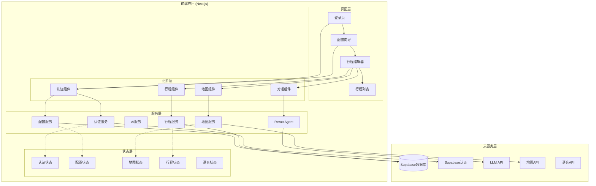
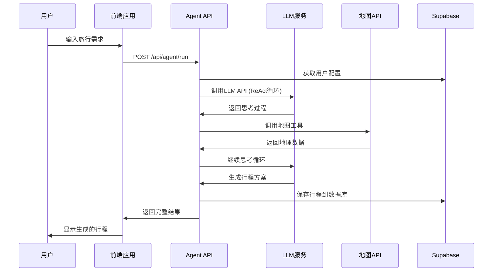

# AI旅行规划师 - 项目架构分析报告

## 📋 文档信息
- **项目名称**: AI Travel Planner (AI 旅行规划师)
- **分析日期**: 2025年11月7日
- **项目类型**: Next.js 14 纯前端应用 + Supabase 后端即服务
- **开发状态**: 核心功能完成，进入优化阶段

---

## 1. 项目概览

### 1.1 项目定位
这是一个**纯前端架构**的智能旅行规划平台，采用现代化的技术栈和完整的工程化实践：

- **技术架构**: Next.js 14 + TypeScript + Supabase + 多种第三方API
- **部署模式**: 静态部署 (Vercel/Netlify) + 云数据库 (Supabase)
- **用户模式**: 用户自配置API密钥，完全控制数据和服务
- **核心价值**: ReAct Agent驱动的智能行程规划 + 可视化地图交互

### 1.2 技术栈总览

```typescript
// 🏗️ 核心框架
Next.js 14.2.33          // App Router + React Server Components  
React 18.3.1             // 最新React特性 (Concurrent Features)
TypeScript 5.9.3         // 严格类型检查

// 🎨 UI & 样式
Ant Design 5.27.6        // 企业级UI组件库
Tailwind CSS 3.4.18      // 原子化CSS框架
@ant-design/nextjs-registry // SSR优化

// 🗄️ 状态管理 & 数据获取  
Zustand 5.0.8            // 轻量级状态管理
Supabase 2.76.1          // BaaS (认证+数据库+存储)

// 🛠️ 工具库
Day.js 1.11.18           // 轻量级时间处理
Crypto-js 4.2.0          // 客户端加密
Recharts 3.3.0           // React图表库

// 🔧 开发工具
ESLint 8.57.1            // 代码质量检查
Autoprefixer + PostCSS   // CSS处理
```

### 1.3 项目规模统计

```
📊 代码统计:
- 总文件数: 148个核心TypeScript/TSX文件
- 代码行数: 约30,000行 (含注释和文档)
- 组件数量: 25+ React组件
- API路由: 15+ Next.js API端点
- 服务模块: 12个业务服务
- 数据库表: 5个主要表 + 关联表

📁 目录结构:
- app/: 20+ 页面和API路由
- components/: 25+ 可复用组件
- services/: 12个业务逻辑服务
- types/: 600+行TypeScript定义
- docs/: 80+ 技术文档
```

---

## 2. 核心架构设计

### 2.1 整体架构图



### 2.2 模块依赖关系

```typescript
// 📦 核心模块依赖
auth (认证) → config (配置) → agent (AI代理) → itinerary (行程)
     ↓           ↓              ↓              ↓
   用户管理    API密钥管理    智能对话      行程管理
     ↓           ↓              ↓              ↓
  Supabase   加密存储      ReAct架构     JSON存储
```

### 2.3 数据流架构



---

## 3. 核心功能模块详解

### 3.1 用户认证系统 (M1)

**技术实现**: Supabase Auth + JWT Token + RLS策略

```typescript
// 🔐 认证架构
class AuthService {
  // 核心功能
  async signIn(email: string, password: string)    // 用户登录
  async signUp(email: string, password: string)    // 用户注册  
  async signOut()                                  // 用户登出
  async getCurrentUser(): Promise<User | null>     // 获取当前用户
  async checkUserConfigStatus(): Promise<ConfigStatus> // 检查配置状态
}

// 🛡️ 路由保护
export function withAuth<P>(Component: React.ComponentType<P>) {
  return function AuthenticatedComponent(props: P) {
    const { user, loading } = useAuthStore()
    // 自动重定向逻辑
  }
}
```

**关键特性**:
- ✅ 基于Supabase的安全认证
- ✅ JWT Token自动刷新
- ✅ 新老用户识别和路由分发
- ✅ RLS (行级安全) 数据保护
- ✅ 多设备会话同步

**文件位置**:
- `services/authService.ts` - 认证服务实现
- `store/authStore.ts` - 认证状态管理
- `app/auth/login/page.tsx` - 登录注册页面

### 3.2 API配置管理系统 (M6)

**技术实现**: 客户端加密 + Supabase存储 + 实时验证

```typescript
// 🔑 配置管理架构
class ConfigService {
  async saveConfig(config: APIConfig)              // 保存配置(加密)
  async loadConfig(): Promise<APIConfig | null>    // 加载配置(解密) 
  async validateConfig(config: APIConfig)          // 实时验证
  async checkConfigStatus(): Promise<ConfigStatus> // 检查完整性
}

// 🔐 加密存储
interface APIConfig {
  llm: { provider: 'aliyun'|'openai', apiKey: string }
  speech: { provider: 'xunfei'|'baidu', apiKey: string }
  map: { provider: 'amap', webServiceKey: string, jsApiKey: string }
}
```

**关键特性**:
- ✅ 客户端AES加密存储
- ✅ 多服务商支持 (LLM/语音/地图)
- ✅ 实时API验证
- ✅ 配置向导引导
- ✅ 安全的密钥管理

**文件位置**:
- `services/configService.ts` - 配置服务
- `lib/crypto.ts` - 加密解密工具
- `app/setup/api-config/page.tsx` - 配置向导页面

### 3.3 ReAct Agent智能规划系统 (M2核心)

**技术实现**: ReAct架构 + 工具调用 + 结构化输出

```typescript
// 🤖 Agent架构
class ReactAgent {
  async run(message: string, maxTurns: number = 10): Promise<AgentResult> {
    for (let turn = 1; turn <= maxTurns; turn++) {
      const thought = await this.think(context)      // Thought: 分析
      const action = await this.plan(thought)        // Action: 规划
      const observation = await this.execute(action)  // Observation: 执行
      
      if (this.shouldAnswer(turn, maxTurns)) {
        const answer = await this.generateAnswer()   // Answer: 输出
        return { success: true, answer, planExtracted }
      }
    }
  }
}

// 🛠️ 工具集
class AgentTools {
  static async calculateDistance(origin, destination, mode)  // 路线规划
  static async searchNearby(location, category, radius)     // 周边搜索
  static async estimateCost(category, nodeType, location)   // 费用估算
}
```

**核心工具**:
1. **calculate_distance**: 高德地图路径规划2.0 API
2. **search_nearby**: 周边POI搜索 (餐厅/酒店/景点)
3. **estimate_cost**: 智能费用估算 (5大类别)

**ReAct循环示例**:
```
用户: "我想去上海旅游3天"
┌─ Thought: 分析用户需求,需要规划3天上海行程
├─ Action: search_nearby: 上海, restaurant, 5000  
├─ Observation: 找到10个推荐餐厅...
├─ Action: calculate_distance: 外滩, 豫园, transit
├─ Observation: 地铁约15分钟,费用3元...
└─ Answer: 为您规划了精彩的3天上海之旅...
```

**文件位置**:
- `services/reactAgent.ts` - Agent核心实现 (1133行)
- `services/agentTools.ts` - 工具集实现 (1093行)
- `app/api/agent/run/route.ts` - Agent API端点

### 3.4 地图可视化系统 (M4)

**技术实现**: 高德地图 + Mapbox备选 + 多图层渲染

```typescript
// 🗺️ 地图服务架构
class MapService {
  async searchPOI(query: string, location?: Location): Promise<POI[]>
  async searchNearbyPOI(options: SearchOptions): Promise<POI[]> 
  async planRoute(origin: Location, destination: Location): Promise<Route>
  async geocode(address: string): Promise<Location>
}

// 🎯 地图组件
function AmapView({ itinerary, onMarkerClick }) {
  // 高德地图初始化
  // POI标点渲染  
  // 路线绘制
  // 交互事件处理
}
```

**关键特性**:
- ✅ 高德地图JS API 2.0集成
- ✅ 行程路线可视化
- ✅ POI搜索和标记
- ✅ 实时路径规划
- ✅ 地理编码服务

**文件位置**:
- `services/mapService.ts` - 地图服务实现 (496行)
- `components/map/AmapView.tsx` - 高德地图组件
- `components/map/ItineraryMapView.tsx` - 行程地图视图

### 3.5 行程数据管理系统 (M2数据层)

**技术实现**: Supabase JSON存储 + TypeScript类型安全

```typescript
// 📋 行程数据结构
interface ItineraryCard {
  id: string
  title: string                    // 行程标题
  destination: string              // 目的地
  startDate?: string              // 开始日期
  endDate?: string                // 结束日期
  travelers: number               // 出行人数
  days: Array<{                   // 每日行程
    dayNumber: number
    date: string
    segments: Array<{             // 时间段
      time: string
      type: 'activity' | 'transport' | 'meal' | 'accommodation'
      title: string
      location: string
      costEstimate?: number
    }>
  }>
  estimatedCost?: {               // 费用估算
    total: number
    breakdown: Array<{
      category: 'transport'|'ticket'|'accommodation'|'meal'|'shopping'
      amount: number
    }>
  }
}
```

**数据库设计**:
```sql
-- 🗄️ 核心表结构
itinerary_cards (
  id UUID PRIMARY KEY,
  user_id UUID REFERENCES auth.users,
  session_group_id UUID UNIQUE,        -- 关联对话会话
  plan_data JSONB NOT NULL,           -- 完整行程JSON
  natural_plan TEXT,                   -- 自然语言描述
  created_at TIMESTAMPTZ DEFAULT now()
)
```

**文件位置**:
- `services/itineraryCardService.ts` - 行程服务实现 (356行)
- `types/index.ts` - 完整类型定义 (606行)
- `supabase/migrations/` - 数据库迁移文件

---

## 4. 关键技术亮点

### 4.1 ReAct Agent实现

这是项目的**核心技术亮点**，实现了完整的AI智能规划：

```typescript
// 🧠 思考-行动-观察循环
const SYSTEM_PROMPT = `
你是专业的旅行规划AI助手，运行在 Thought → Action → PAUSE → Observation 循环中
当你认为规划完整时，输出 Answer

可用工具:
1. calculate_distance: 计算两地交通信息  
2. search_nearby: 搜索周边配套设施
3. estimate_cost: 估算单个节点费用
`

async function agentLoop(userMessage: string) {
  for (let turn = 1; turn <= maxTurns; turn++) {
    const response = await llm.chat([
      { role: 'system', content: SYSTEM_PROMPT },
      { role: 'user', content: userMessage },
      ...conversationHistory
    ])
    
    if (response.includes('Action:')) {
      const toolResult = await executeTool(parseAction(response))
      conversationHistory.push({ role: 'system', content: toolResult.observation })
    } else if (response.includes('Answer:')) {
      const plan = extractPlanStructure(response)
      return { success: true, finalAnswer: response, planExtracted: plan }
    }
  }
}
```

### 4.2 类型安全的数据流

项目采用**严格的TypeScript类型系统**，确保数据一致性：

```typescript
// 🛡️ 端到端类型安全
用户输入 → TravelRequirements → AgentRun → ItineraryCard → Supabase JSONB
   ↓            ↓                ↓            ↓              ↓
string      interface         interface   interface      database
```

### 4.3 渐进式配置系统

**用户友好的配置流程**，降低使用门槛：

```typescript
// 🎯 智能路由分发
async function routeAfterAuth(user: User) {
  const configStatus = await checkConfigStatus(user.id)
  
  if (!configStatus.isConfigComplete) {
    return '/setup/api-config'  // 新用户 → 配置向导
  } else {
    return '/itinerary/edit'    // 老用户 → 直接使用
  }
}
```

### 4.4 安全的密钥管理

**客户端加密存储**，保护用户隐私：

```typescript
// 🔐 加密存储流程
用户输入API密钥 → AES加密(用户ID作为密钥) → Supabase存储 → RLS保护
```

---

## 5. 代码质量分析

### 5.1 代码组织结构

**优点** ✅:
- **模块化设计**: 清晰的服务层抽象
- **类型安全**: 完整的TypeScript类型定义  
- **组件复用**: 良好的React组件抽象
- **文档完善**: 详细的注释和文档

**改进空间** ⚠️:
- 部分组件过大，可进一步拆分
- 某些工具函数可以抽象为通用库
- 错误处理可以更统一

### 5.2 性能优化

**已实现** ✅:
- **请求节流**: 地图API调用限制QPS
- **组件懒加载**: React.lazy动态导入
- **状态优化**: Zustand轻量级状态管理
- **缓存策略**: Supabase实时订阅

**待优化** 📋:
- 地图组件内存管理
- 大型JSON数据的分页加载
- 图片资源懒加载

### 5.3 废弃代码检查

通过代码扫描，发现以下废弃内容：

**已废弃但保留兼容** ⚠️:
```typescript
// services/mapService.ts:100
* @deprecated 请使用 setWebServiceKey 替代
setApiKey(key: string) {
  this.setWebServiceKey(key)
}
```

**计划移除** 📋:
```typescript
// app/dashboard/page.tsx - 已重定向到新页面
// supabase/migrations/ - 部分旧迁移文件可归档
```

**TODO项目** 📋:
```typescript
// components/chat/ChatInterface.tsx:46
// TODO: 从后端加载历史消息

// app/itineraries/page.tsx:238  
// TODO: 生成分享链接
```

---

## 6. 技术债务和改进建议

### 6.1 高优先级改进

1. **统一错误处理** 🔴
   - 建立全局错误处理机制  
   - 用户友好的错误提示
   - 错误日志和监控

2. **性能监控** 🟡
   - 添加性能指标追踪
   - API响应时间监控
   - 用户体验指标

3. **测试覆盖** 🟡  
   - 单元测试 (Jest + Testing Library)
   - 集成测试 (Cypress)
   - API测试 (Postman/Newman)

### 6.2 中等优先级改进

1. **国际化支持** 🔵
   - 多语言切换
   - 货币本地化
   - 时区适配

2. **移动端优化** 🔵
   - 响应式布局完善
   - 触摸手势支持
   - PWA特性增强

3. **数据导出** 🔵
   - PDF行程单生成
   - 数据备份导出
   - 行程分享功能

### 6.3 低优先级改进

1. **高级功能** 🟢
   - 协同编辑
   - 社区分享
   - 智能推荐

---

## 7. 部署和运维

### 7.1 推荐部署方案

```yaml
# 🚀 生产部署
平台: Vercel (推荐)
优势: 
  - 自动CI/CD
  - 全球CDN
  - Next.js原生支持
  - Serverless函数

备选: Netlify, GitHub Pages

数据库: Supabase (托管PostgreSQL)
优势:
  - 内置认证
  - 实时订阅  
  - 自动备份
  - 行级安全
```

### 7.2 环境变量配置

```bash
# 🔧 必需配置
NEXT_PUBLIC_SUPABASE_URL=your_supabase_url
NEXT_PUBLIC_SUPABASE_ANON_KEY=your_supabase_anon_key

# 🎛️ 可选配置  
NEXT_PUBLIC_AGENT_MAX_TURNS=10
NEXT_PUBLIC_AGENT_WARNING_TURN=8
```

---

## 8. 总结评价

### 8.1 项目成熟度评估

| 维度 | 评分 | 说明 |
|------|------|------|
| 功能完整性 | 9/10 | 核心功能全部实现 |
| 代码质量 | 8/10 | 结构清晰，类型安全 |
| 用户体验 | 8/10 | 界面友好，交互流畅 |
| 技术先进性 | 9/10 | 采用最新技术栈 |
| 可维护性 | 8/10 | 模块化设计，文档完善 |
| 可扩展性 | 8/10 | 良好的架构设计 |

**总体评分**: 8.3/10 ⭐⭐⭐⭐⭐

### 8.2 核心优势

1. **技术架构先进** 🚀
   - Next.js 14最新特性
   - 纯前端部署模式
   - ReAct Agent智能规划

2. **用户体验优秀** 💎
   - 一站式旅行规划
   - 智能对话交互
   - 可视化地图展示

3. **工程化完善** 🛠️
   - TypeScript类型安全
   - 完整的文档体系
   - 模块化代码组织

### 8.3 建议发展方向

1. **商业化路径** 💰
   - 增值服务 (高级AI模型)
   - 合作伙伴集成 (OTA平台)
   - 企业版本 (团队协作)

2. **技术演进** 🔬  
   - AI能力增强 (多模态输入)
   - 实时协作功能
   - 移动端原生应用

3. **生态建设** 🌐
   - 开放API平台
   - 第三方插件系统
   - 开发者社区

---

**📋 文档状态**: ✅ 完成
**🔄 更新频率**: 随项目迭代更新  
**📧 维护者**: 项目团队
**📅 下次评估**: 3个月后