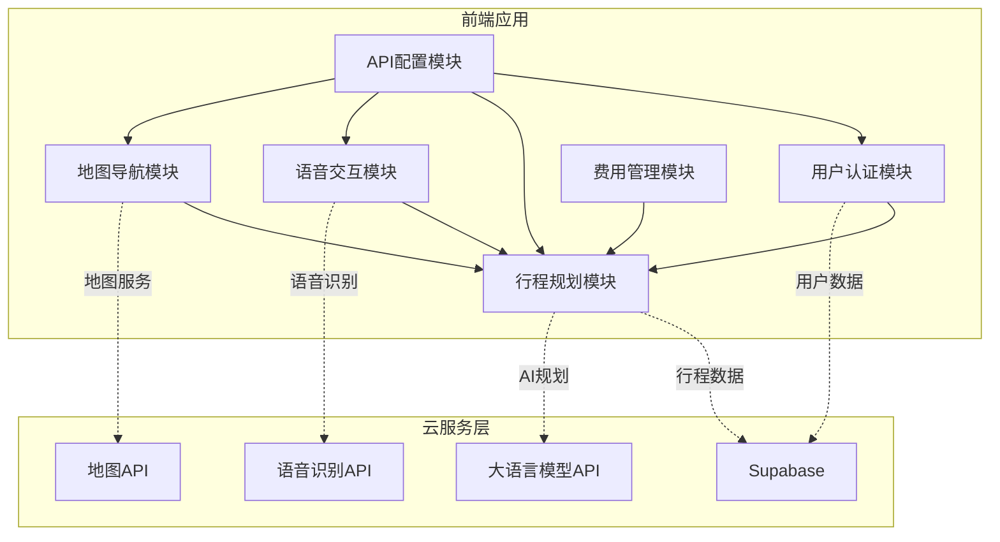
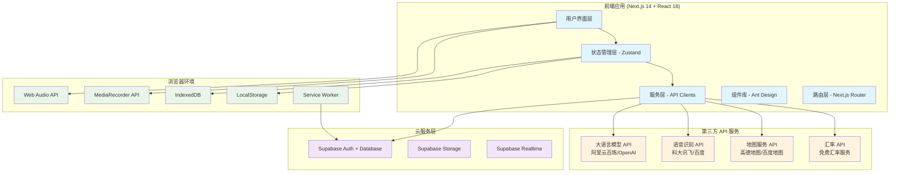
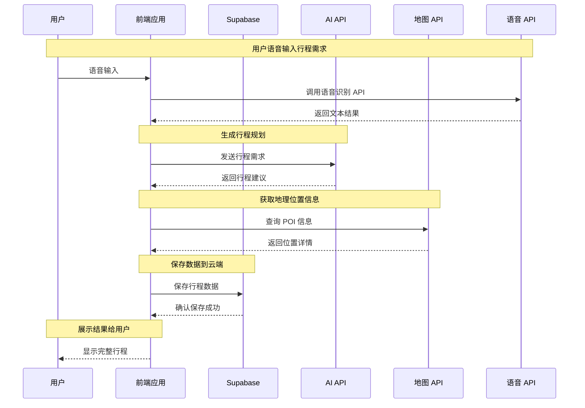
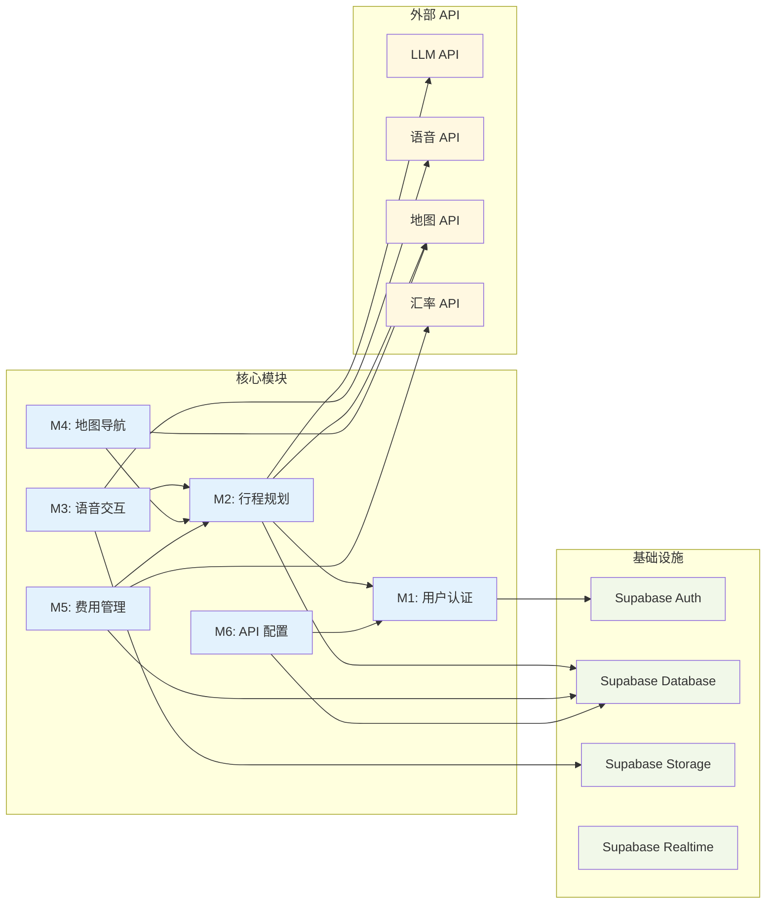

# Web 版 AI 旅行规划师需求规格说明书（纯前端版）

## 1. 项目概述

### 1.1 项目背景
随着人工智能技术的快速发展和旅游业的数字化转型，传统的旅行规划方式已无法满足用户对个性化、智能化旅行体验的需求。本项目旨在构建一款**纯前端**的 Web 版 AI 旅行规划师，通过直接调用第三方 API 和云端存储服务，实现集成语音交互、智能规划、实时辅助于一体的旅行规划平台。

### 1.2 项目目标
- **核心目标**：构建支持多模态输入（语音/文本）的纯前端智能旅行规划平台
- **用户价值**：提供个性化行程规划、智能预算管理、实时旅行辅助
- **技术目标**：实现前端直连 LLM API、云端数据同步、跨设备协同
- **业务目标**：简化旅行规划流程，提升用户旅行体验

### 1.3 系统架构特点
- **🌐 纯前端架构**：无需后端服务器，降低部署复杂度
- **☁️ 云端数据存储**：使用 Supabase 实现用户数据和行程同步
- **🔗 API 直连**：前端直接调用第三方 API（语音、地图、AI）
- **📱 SPA 应用**：单页面应用，支持离线缓存
- **🔑 API Key 管理**：用户自主配置 API 密钥

### 1.4 核心特性
- **智能语音交互**：支持自然语言输入旅行需求（必备功能）
- **AI 行程规划**：基于大语言模型 API 生成个性化旅行方案
- **预算管理**：智能费用预估与语音记账
- **云端同步**：多设备数据一致性保障
- **地图集成**：以地图为主的交互界面，可视化行程展示
- **API 配置界面**：用户自主配置各种 API 密钥

## 2. 技术架构与模块划分

### 2.1 纯前端架构概览
系统采用纯前端 SPA 架构，分为 6 个核心模块，通过第三方 API 和云服务实现完整功能：



### 2.2 模块职责分工
- **M1 - 用户认证模块**：基于 Supabase Auth 的用户管理
- **M2 - 行程规划模块**：核心业务逻辑，AI 对话和行程生成
- **M3 - 语音交互模块**：语音录制、识别和处理
- **M4 - 地图导航模块**：地图展示、POI 搜索、路线规划
- **M5 - 费用管理模块**：预算估算、费用记录和分析
- **M6 - API 配置模块**：用户自主配置各种 API 密钥

### 2.3 技术选型

#### 2.3.1 前端技术栈
```typescript
// 核心框架
Next.js 14          // React 全栈框架，支持 SSG/ISR
React 18            // UI 组件库
TypeScript          // 类型安全
Tailwind CSS        // 原子化 CSS
Ant Design          // UI 组件库

// 状态管理
Zustand             // 轻量级状态管理
React Query         // 数据获取和缓存

// 地图相关
Mapbox GL JS        // 地图渲染引擎
React Map GL        // React 地图组件

// 语音处理
MediaRecorder API   // 原生录音
Web Audio API       // 音频处理
```

#### 2.3.2 云服务选型
```yaml
# 数据存储和认证
Supabase:
  - PostgreSQL 数据库
  - 实时数据同步
  - 用户认证系统
  - 文件存储

# AI 服务（用户可选）
大语言模型:
  - 阿里云百炼（推荐）
  - OpenAI GPT-4
  - 字节豆包
  - 百度千帆

# 语音服务（用户可选）
语音识别:
  - 科大讯飞 WebAPI
  - 百度语音
  - 阿里云智能语音

# 地图服务
地图API:
  - 高德地图 API
  - 百度地图 API（备选）
```

#### 2.3.3 部署方案
```yaml
部署平台:
  - Vercel（推荐）       # 自动部署，CDN 加速
  - Netlify              # 静态站点托管
  - GitHub Pages         # 免费托管
  
Docker化:
  - Nginx 静态服务器     # 生产环境
  - 多阶段构建           # 优化镜像大小
```

## 3. 开发计划与模块顺序

### 3.1 第一阶段：基础框架搭建（优先级：P0）
**开发顺序**：项目初始化 → M6 → M1
**开发周期**：1-2 周

**具体任务**：
1. **项目初始化**：
   - Next.js 项目搭建
   - TypeScript 配置
   - Tailwind CSS + Ant Design 集成
   - 代码规范和工具链配置

2. **M6 - API 配置模块**：
   - API 密钥管理界面
   - 配置项验证功能
   - 本地存储机制
   - 配置导入导出

3. **M1 - 用户认证模块**：
   - Supabase 集成
   - 登录注册界面
   - 用户会话管理
   - 权限控制

**理由**：API 配置是其他模块的前置依赖，用户认证是数据持久化的基础。

### 3.2 第二阶段：核心界面开发（优先级：P1）
**开发顺序**：M4 → M2 → 前端界面集成
**开发周期**：2-3 周

**具体任务**：
1. **M4 - 地图导航模块**：
   - 高德地图集成
   - 地图基础功能
   - POI 搜索界面
   - 路线展示组件

2. **M2 - 行程规划模块**：
   - AI 对话界面
   - 行程展示组件
   - 行程编辑功能
   - 数据存储逻辑

3. **主界面布局**：
   - 响应式布局设计
   - 地图与对话面板集成
   - 导航栏和侧边栏
   - 移动端适配

**理由**：地图是主要交互界面，行程规划是核心功能，需要优先完成并验证用户体验。

### 3.3 第三阶段：增强功能开发（优先级：P2）
**开发顺序**：M3 → M5 → 功能完善
**开发周期**：2-3 周

**具体任务**：
1. **M3 - 语音交互模块**：
   - 语音录制组件
   - 语音识别集成
   - 音频播放功能
   - 语音指令处理

2. **M5 - 费用管理模块**：
   - 预算设置界面
   - 费用记录功能
   - 语音记账集成
   - 费用分析图表

3. **功能完善**：
   - 数据导入导出
   - 离线功能支持
   - 性能优化
   - 错误处理

**理由**：语音交互是重要特性，费用管理增强用户价值，最后进行整体优化。

### 3.4 第四阶段：测试与部署（优先级：P3）
**开发顺序**：测试 → 优化 → 部署
**开发周期**：1 周

**具体任务**：
- 端到端测试
- 性能优化
- Docker 镜像制作
- 部署文档编写

## 4. 各模块详细规格

### 4.1 M1 - 用户认证模块

#### 4.1.1 功能规格
**核心功能**：
- 用户注册/登录（邮箱、OAuth）
- 用户资料管理
- 会话状态管理
- 云端数据同步授权

**技术实现**：
- **认证服务**：Supabase Auth
- **前端实现**：@supabase/auth-helpers-nextjs
- **状态管理**：Zustand 全局状态
- **持久化**：localStorage + Supabase Session

#### 4.1.2 接口设计
```typescript
// 用户认证接口
interface AuthService {
  signIn(email: string, password: string): Promise<User>
  signUp(email: string, password: string, profile: UserProfile): Promise<User>
  signOut(): Promise<void>
  resetPassword(email: string): Promise<void>
  getCurrentUser(): User | null
}

// 用户数据模型
interface User {
  id: string
  email: string
  displayName?: string
  avatar?: string
  locale: string
  currency: string
  createdAt: string
}
```

#### 4.1.3 UI 组件
- **LoginPage**: 登录注册页面
- **UserProfile**: 用户资料编辑
- **AuthGuard**: 路由保护组件

### 4.2 M2 - 行程规划模块

#### 4.2.1 功能规格
**核心功能**：
- AI 对话式行程规划
- 行程编辑和优化
- 行程模板管理
- 偏好设置和历史记录

**技术实现**：
- **AI 服务**：直接调用大语言模型 API
- **对话管理**：React state + 消息队列
- **数据存储**：Supabase 实时数据库
- **模板引擎**：自定义 Prompt 模板

#### 4.2.2 接口设计
```typescript
// AI 服务接口
interface AIService {
  generateItinerary(requirements: TravelRequirements): Promise<Itinerary>
  optimizeItinerary(itinerary: Itinerary, feedback: string): Promise<Itinerary>
  chatWithAI(message: string, context: ChatContext): Promise<string>
}

// 行程数据模型
interface Itinerary {
  id: string
  userId: string
  title: string
  destination: string
  startDate: string
  endDate: string
  travelers: number
  budget: number
  days: DayPlan[]
  preferences: TravelPreferences
  status: 'draft' | 'confirmed' | 'completed'
}

interface DayPlan {
  date: string
  activities: Activity[]
  transportation: Transportation[]
  accommodation?: Accommodation
  totalCost: number
}
```

#### 4.2.3 UI 组件
- **ChatInterface**: AI 对话界面
- **ItineraryViewer**: 行程展示组件
- **ItineraryEditor**: 行程编辑器
- **PreferencesPanel**: 偏好设置面板

### 4.3 M3 - 语音交互模块

#### 4.3.1 功能规格
**核心功能**：
- 实时语音录制
- 语音转文本识别
- 语音指令处理
- 音频文件管理

**技术实现**：
- **录音接口**：MediaRecorder API
- **音频处理**：Web Audio API
- **语音识别**：科大讯飞 WebAPI 等
- **文件处理**：Blob + FormData

#### 4.3.2 接口设计
```typescript
// 语音服务接口
interface VoiceService {
  startRecording(): Promise<void>
  stopRecording(): Promise<Blob>
  transcribeAudio(audioBlob: Blob): Promise<TranscriptionResult>
  playAudio(audioUrl: string): Promise<void>
}

// 语音识别结果
interface TranscriptionResult {
  text: string
  confidence: number
  intent?: VoiceIntent
  entities?: Record<string, any>
}

interface VoiceIntent {
  action: 'create_itinerary' | 'modify_itinerary' | 'add_expense' | 'search_poi'
  parameters: Record<string, any>
}
```

#### 4.3.3 UI 组件
- **VoiceRecorder**: 语音录制组件
- **VoiceIndicator**: 录音状态指示器
- **AudioPlayer**: 音频播放器
- **VoiceSettings**: 语音设置面板

### 4.4 M4 - 地图导航模块

#### 4.4.1 功能规格
**核心功能**：
- 地图展示和交互
- POI 搜索和标记
- 路线规划和导航
- 行程可视化

**技术实现**：
- **地图引擎**：Mapbox GL JS
- **地图服务**：高德地图 API
- **地理编码**：高德 Geocoding API
- **路线规划**：高德 Directions API

#### 4.4.2 接口设计
```typescript
// 地图服务接口
interface MapService {
  searchPOI(query: string, location: Location): Promise<POI[]>
  getPOIDetail(id: string): Promise<POIDetail>
  planRoute(origin: Location, destination: Location, mode: TransportMode): Promise<Route>
  geocode(address: string): Promise<Location>
  reverseGeocode(location: Location): Promise<string>
}

// 地理数据模型
interface POI {
  id: string
  name: string
  category: string
  location: Location
  rating?: number
  photos?: string[]
  description?: string
  openHours?: string
}

interface Route {
  distance: number
  duration: number
  polyline: string
  steps: RouteStep[]
}
```

#### 4.4.3 UI 组件
- **MapContainer**: 地图容器组件
- **POIMarker**: POI 标记组件
- **RouteLayer**: 路线图层
- **POISearch**: POI 搜索组件

### 4.5 M5 - 费用管理模块

#### 4.5.1 功能规格
**核心功能**：
- 预算设置和分配
- 费用记录和分类
- 语音记账功能
- 费用统计和分析

**技术实现**：
- **数据存储**：Supabase 数据库
- **图表展示**：Chart.js / Recharts
- **语音记账**：集成 M3 语音识别
- **汇率转换**：免费汇率 API

#### 4.5.2 接口设计
```typescript
// 费用管理接口
interface ExpenseService {
  setBudget(itineraryId: string, budget: Budget): Promise<void>
  addExpense(expense: Expense): Promise<Expense>
  getExpenseAnalytics(itineraryId: string): Promise<ExpenseAnalytics>
  convertCurrency(amount: number, from: string, to: string): Promise<number>
}

// 费用数据模型
interface Budget {
  total: number
  categories: {
    transportation: number
    accommodation: number
    food: number
    activities: number
    shopping: number
  }
  currency: string
}

interface Expense {
  id: string
  itineraryId: string
  amount: number
  category: ExpenseCategory
  description: string
  date: string
  location?: string
  receipt?: string
}
```

#### 4.5.3 UI 组件
- **BudgetPlanner**: 预算规划组件
- **ExpenseRecorder**: 费用记录器
- **ExpenseAnalytics**: 费用分析图表
- **VoiceExpense**: 语音记账组件

### 4.6 M6 - API 配置模块

#### 4.6.1 功能规格
**核心功能**：
- API 密钥管理
- 服务提供商选择
- 配置验证和测试
- 配置导入导出

**技术实现**：
- **存储方式**：localStorage + 加密
- **配置验证**：API 健康检查
- **备用方案**：多服务商支持
- **安全处理**：客户端加密存储

#### 4.6.2 接口设计
```typescript
// API 配置接口
interface APIConfig {
  llm: {
    provider: 'aliyun' | 'openai' | 'baidu'
    apiKey: string
    baseUrl?: string
    model?: string
  }
  speech: {
    provider: 'xunfei' | 'baidu' | 'aliyun'
    apiKey: string
    appId?: string
    apiSecret?: string
  }
  map: {
    provider: 'amap' | 'baidu'
    apiKey: string
  }
}

interface ConfigService {
  saveConfig(config: APIConfig): Promise<void>
  loadConfig(): Promise<APIConfig | null>
  validateConfig(config: APIConfig): Promise<ValidationResult>
  exportConfig(): string
  importConfig(configStr: string): Promise<APIConfig>
}
```

#### 4.6.3 UI 组件
- **ConfigPanel**: 配置主面板
- **APIKeyInput**: API 密钥输入组件
- **ConfigValidator**: 配置验证器
- **ConfigManager**: 配置导入导出管理器

## 5. 系统架构图

### 5.1 整体架构图



### 5.2 数据流架构



### 5.3 模块依赖关系



## 6. 技术栈选择

### 6.1 前端技术栈

| 技术领域 | 选择方案 | 版本 | 选择理由 |
|---------|----------|------|----------|
| **框架** | Next.js | 14.x | SSR/SSG 支持，优秀的开发体验，SEO 友好 |
| **UI 库** | React | 18.x | 生态成熟，组件化开发，hooks 支持 |
| **UI 组件** | Ant Design | 5.x | 组件丰富，设计规范，国际化支持 |
| **样式方案** | Tailwind CSS | 3.x | 原子化 CSS，开发效率高，体积小 |
| **状态管理** | Zustand | 4.x | 轻量级，TypeScript 友好，简单易用 |
| **类型检查** | TypeScript | 5.x | 类型安全，开发体验好，重构友好 |
| **地图组件** | Mapbox GL JS | 2.x | 性能优秀，自定义能力强，移动端适配好 |
| **图表组件** | Chart.js / Recharts | 4.x / 2.x | 图表类型丰富，交互性好，文档完善 |
| **音频处理** | Web Audio API | - | 浏览器原生支持，功能强大 |

### 6.2 云服务与 API

| 服务类型 | 主要方案 | 备用方案 | 选择理由 |
|---------|----------|----------|----------|
| **数据库** | Supabase PostgreSQL | - | 实时同步，RLS 安全，TypeScript 支持 |
| **认证** | Supabase Auth | - | 多种认证方式，安全性高，易集成 |
| **文件存储** | Supabase Storage | - | 与数据库集成，权限控制完善 |
| **实时通信** | Supabase Realtime | - | WebSocket 支持，低延迟，易集成 |
| **AI 模型** | 阿里云百炼 | OpenAI GPT | 国内服务稳定，价格友好，中文优化 |
| **语音识别** | 科大讯飞 WebAPI | 百度语音 | 中文识别精度高，WebAPI 方便 |
| **地图服务** | 高德开放平台 | 百度地图 | 国内数据准确，API 丰富，免费额度大 |
| **汇率服务** | ExchangeRate-API | Fixer.io | 免费额度充足，更新频率高 |

### 6.3 开发工具链

| 工具类型 | 选择方案 | 用途 |
|---------|----------|------|
| **包管理** | npm / yarn | 依赖管理，脚本执行 |
| **代码格式化** | Prettier | 代码风格统一 |
| **代码检查** | ESLint | 代码质量检查 |
| **测试框架** | Jest + React Testing Library | 单元测试，组件测试 |
| **类型检查** | TypeScript | 编译时类型检查 |
| **构建工具** | Next.js 内置 | 打包、优化、部署 |
| **部署平台** | Vercel | 自动部署，CDN 加速，Serverless |

### 6.4 API 密钥管理策略

由于是纯前端架构，API 密钥管理需要特别注意安全性：

#### 6.4.1 安全存储方案
- **用户配置**: 用户自行配置 API 密钥，存储在浏览器本地
- **加密存储**: 使用 Web Crypto API 进行客户端加密
- **环境隔离**: 开发/生产环境分离配置

#### 6.4.2 密钥配置流程
```typescript
// API 密钥配置接口
interface APIKeyConfig {
  llm: {
    provider: 'aliyun' | 'openai'
    apiKey: string
    baseUrl?: string
  }
  speech: {
    provider: 'xunfei' | 'baidu'
    apiKey: string
    appId?: string
    secret?: string
  }
  map: {
    provider: 'amap' | 'baidu'
    apiKey: string
  }
}
```

#### 6.4.3 最佳实践
- 提供配置向导，引导用户获取 API 密钥
- 实现配置验证，确保密钥有效性
- 支持配置导入导出（加密格式）
- 提供多服务商支持，增强可用性

### 6.5 性能优化策略

#### 6.5.1 前端优化
- **代码分割**: Next.js 动态导入，按需加载
- **图片优化**: Next.js Image 组件，WebP 格式
- **缓存策略**: Service Worker 缓存静态资源
- **预加载**: 关键路由和组件预加载

#### 6.5.2 API 调用优化
- **请求缓存**: 本地缓存 API 响应结果
- **批量请求**: 合并多个 API 调用
- **重试机制**: 网络错误自动重试
- **降级策略**: 主要服务失败时的备用方案

## 7. 总结与风险提示

### 7.1 关键成功因素
1. **API 密钥配置体验**：提供简洁直观的配置界面，引导用户正确设置各项 API 密钥
2. **前端性能优化**：确保纯前端架构下的响应速度和用户体验
3. **阿里云百炼集成**：确保 AI 助手对话的稳定性和响应速度
4. **离线支持能力**：实现关键数据的本地缓存和离线访问
5. **多设备同步**：基于 Supabase 的实时数据同步
6. **用户体验**：注重语音交互的准确性和行程规划的智能性

### 7.2 主要技术风险
1. **API 密钥安全性**：客户端存储敏感信息的安全风险
2. **第三方 API 依赖**：网络问题或服务商限制影响功能可用性
3. **浏览器兼容性**：Web Audio API 和 MediaRecorder 的兼容性问题
4. **用户配置复杂性**：多个 API 密钥配置可能导致用户流失
5. **性能瓶颈**：大量 API 调用可能影响应用响应速度

### 7.3 建议缓解措施
1. **配置向导开发**：提供详细的 API 密钥获取和配置指南
2. **客户端加密**：使用 Web Crypto API 加密存储敏感信息
3. **多服务商支持**：为每种 API 提供多个服务商选择
4. **渐进式功能**：允许用户逐步配置，核心功能可独立使用
5. **充分测试**：在多种浏览器和设备上测试兼容性
6. **性能监控**：实现前端性能监控和优化
7. **用户反馈机制**：收集用户使用反馈，持续优化体验

### 7.4 项目里程碑
- **里程碑 1**（第4周）：基础界面和 API 配置模块完成
- **里程碑 2**（第8周）：核心功能模块开发完成
- **里程碑 3**（第12周）：功能集成和测试完成
- **里程碑 4**（第14周）：完整功能交付，部署上线

该需求规格说明书为纯前端 AI 旅行规划助手的开发提供了详细的技术路线图和实施指南，确保项目能够按计划高质量交付。